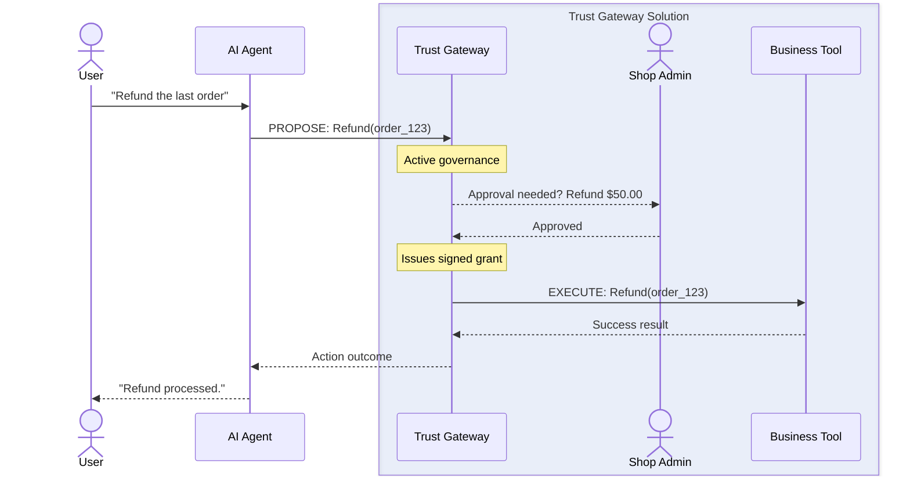

# AI Agents Trust Gateway -- Community Edition

> **The execution control plane for the agentic era.**  
> Built in Rust. Runs self-hosted. No cloud dependency.
> An agent can draft a contract, but it has no power to sign it. Only the Notary has the official stamp

[](https://www.rust-lang.org)
[](LICENSE)
[](https://nats.io)
[](https://modelcontextprotocol.io)
[](#zero-to-running--3-commands)

---

**Show your support!**  
If you find this project useful, please consider giving it a ⭐ on GitHub! It helps more developers discover the control plane for the agentic era.

---

## Zero to Running — 3 commands

> No cloud account. No API key. No config file to edit first.

**Check Prerequisites:** You need **Rust 1.75+**, **NATS Server**, and **Trunk** installed.  
*(→ [Full Setup Guide](#full-configuration-reference) for first-time installation)*

```bash
git clone https://github.com/fcn06/trust_gateway.git
cd trust_gateway
make build && ./start_dev.sh
```

**That's it.** Open [http://localhost:8080](http://localhost:8080) — 
your governance portal is live.

The dev script auto-generates all secrets. 
You can read the architecture after you've seen it work.

---

**What just started:**

| Component | Address | What it does |
|---|---|---|
| Portal (Web UI) | `localhost:8080` | Identity, approvals, policy builder |
| Trust Gateway | `localhost:3060` | Governance engine — point your agent here |
| NATS JetStream | `localhost:4222` | Audit trail + messaging backbone |

**Point your MCP-compatible agent at:**
`http://localhost:3060/v1/mcp/sse`

Or test manually:
```bash
# Is it alive?
curl http://localhost:3060/health

# Propose your first action
curl -X POST http://localhost:3060/v1/actions/propose \
  -H "Content-Type: application/json" \
  -d '{"action_name": "hello_world", "arguments": {}}'
```

---

## What you'll see

### The Validation Center
When an agent proposes an action that violates a "High Risk" policy, execution pauses. You get a real-time notification in the portal to **Approve** or **Deny** with a full business diff of the intent.

### Visual Policy Builder
Define your trust boundaries without writing code. Set thresholds for financial transactions, restrict sensitive tool access, and simulate policy changes before deploying them.

### Mobile Approvals via Telegram
Receive instant notifications when your agent needs approval. 
Approve or deny with one tap — without opening the portal.

---

## The Problem

Your AI agent just sent an email to the wrong client. Or called a payment API with hallucinated parameters. Or deleted records that a hundred downstream processes depend on.

This isn't a model quality problem. **It's an architecture problem.**

Existing security frameworks were built for two kinds of actors: humans and static service accounts. Neither model fits an autonomous agent — an actor with dynamic intent, no fixed permission scope, and the ability to chain dozens of tool calls whose combined effect is invisible from any individual operation.

**Trust Gateway solves this** by inserting a deterministic governance layer between your agents and your business systems. Every agentic intent is treated as a *proposed action* until it clears a cryptographic and policy hurdle. Nothing executes unless the gateway says so.

---

## The Active Control Plane: Intent vs. Execution

Most security layers are passive filters—they just watch traffic pass by. Trust Gateway is an **active execution plane**. It doesn't just watch; it **owns** the execution process.

Think of it like a **Notary Public** for AI. An agent can draft a contract (a tool call), but it has no power to sign it. Only the Notary (Trust Gateway) has the official stamp (cryptographic keys) to validate the intent and actually "file" it (execute the tool).

### High-Level Flow



By decoupling **intelligence** (the AI) from **capability** (the tools), we ensure that even if an agent "hallucinates" a dangerous command, it lacks the cryptographic authority to actually make it happen.

---

## Full Configuration Reference

### Prerequisites

- **Rust** 1.75+ (`rustup` recommended)
- **Wasmtime** — consumed as the `wasmtime` Rust crate (no separate binary install needed)
- **Wasm target**: `rustup target add wasm32-wasip2`
- **NATS Server** with JetStream: `nats-server -js`
- **Trunk** for the Web UI: `cargo install --locked trunk`

> **Tip:** A single-command Docker Compose setup (NATS included) 
> is on the roadmap. Star the repo to be notified.

### Build & Run

```bash
git clone https://github.com/fcn06/trust_gateway.git
cd trust_gateway
make build
./start_dev.sh
```

The `start_dev.sh` script auto-generates a random `JWT_SECRET` if one is not set in `.env`.

Once running, open the **Local SSI Portal** at **[http://localhost:8080/](http://localhost:8080/)** — a WebAuthn-authenticated web interface for identity management, agent interaction, and approval workflows. Once logged in, through developer console, you can get a JWT token, that you can use to interact with the gateway.

### Verify

```bash
# Check the gateway is up
curl http://localhost:3060/health

# List available tools
curl http://localhost:3060/v1/tools/list

# Propose an action (REST path - non-escalated example)
curl -X POST http://localhost:3060/v1/actions/propose \
  -H "Authorization: Bearer <your_session_jwt>" \
  -H "Content-Type: application/json" \
  -d '{
    "action_name": "claw_weather",
    "arguments": { "location": "Paris" }
  }'

# MCP path — connect your agent to:
# http://localhost:3060/v1/mcp/sse
```

---

## Interactive Walkthrough: From Intent to Execution

Once you have the stack running (via `./start_dev.sh`), follow these steps to see the governance layer in action.

### Step 1: Propose an Action via API

Simulate an agent intent by proposing a Google Calendar event. You will need a session JWT, which you can find in the **Local SSI Portal** session debug logs or session storage.

```bash
curl -X POST http://localhost:3060/v1/actions/propose \
  -H "Authorization: Bearer <your-session-jwt>" \
  -H "Content-Type: application/json" \
  -d '{
    "action_name": "google.calendar.event.create",
    "arguments": { "summary": "Strategy Meeting", "start": "2026-04-24T11:00:00Z" }
  }'
```

**Expected Response:**
The Gateway intercepts the request and, based on the default policy, flags it for manual approval:
```json
{
  "action_id": "7f7f7213-f7ba-458d-8d4f-2fd62de3fab2",
  "status": "pending_approval",
  "approval_id": "5b9c6bff-e830-4f81-bc26-195be95f3470",
  "escalation": "tier1_portal_click"
}
```

### Step 2: Human-in-the-Loop Validation

1. Open the **Local SSI Portal** at `http://localhost:8080`.
2. Navigate to the **Validation** area.
3. You will see the pending `google.calendar.event.create` request. Here you can inspect the raw arguments and decide whether to **Approve** or **Deny** the action.

### Step 3: Verified Execution

If you are connected via an MCP-compatible client (like Claude Desktop or another agent runtime):
1. Upon clicking **Approve**, the Gateway issues a cryptographic execution grant.
2. The Gateway dispatches the action to the appropriate connector.
3. The agent receives the confirmation and the full return payload (e.g., the created calendar event details).

---

## Why This Exists

Most "AI gateway" projects are reverse proxies with rate limiting bolted on. Trust Gateway is an **execution control plane** — a fundamentally different architecture:

| Concern | Typical API Gateway | Trust Gateway |
|---|---|---|
| Unit of control | HTTP request | Proposed Action (intent) |
| Trust model | Network perimeter | Cryptographic execution grant (Ed25519 JWT) |
| Policy | Allow/deny by route | Allow / Require Approval / Deny by identity + operation |
| Human oversight | None | First-class human-in-the-loop primitive |
| Audit | Access logs | Durable, replayable JetStream event trail |
| Identity | API key / token | DID + WebAuthn passkey (FIDO2) |
| Replay prevention | None | JTI nonce store — each grant consumed exactly once |
| Skill runtime | N/A | OS process isolation (Wasm sandboxing in Enterprise) |

---

## Architecture

The gateway decouples **intelligence** (the LLM) from **capability** (the tools) via a governance layer that cannot be bypassed:

```
User Intent
    │
    ▼
Host Orchestrator  ←── WebAuthn / DID identity
    │
    ▼
Execution Orchestrator (ssi_agent / External Swarm)
    │
    ▼
┌─────────────────────────────────────┐
│          TRUST GATEWAY              │
│                                     │
│  1. Identity Resolution (DID/JWT)   │
│  2. Policy Evaluation (TOML rules)  │
│  3. Execution Grant issuance        │
│     (Ed25519 or HMAC-SHA256 JWT)    │
│  4. Audit event → JetStream         │
│  5. Human approval (if required)    │
│  6. JTI replay prevention           │
└──────────────┬──────────────────────┘
               │  Signed ExecutionGrant
               ▼
     Specialized Executors
     (MCP connectors / Claw skills)
```

### The Host: Wasm Component Model Architecture

The Host is the most technically differentiated component in this project. It is not a conventional service — it is a **WebAssembly Component Model host** (via Wasmtime) that loads cryptographic and identity primitives as sandboxed Wasm modules at runtime.

#### How It Works

Critical modules — `ssi_vault` (key management, DID generation, JWT signing), `acl_store` (connection policy enforcement), `contact_store`, and `messaging_service` — are compiled to `.wasm` binaries and loaded dynamically at startup. Each component is bound through **WIT (WebAssembly Interface Types)** interfaces, which provide:

- **Memory-safe boundaries** — Wasm's linear memory model isolates each component. A vulnerability in one module cannot escape its sandbox.
- **Interface-typed contracts** — WIT defines precise function signatures between the host runtime and its components. No serialization ambiguity, no FFI footguns.
- **Async component execution** — The host uses Wasmtime's async support (`wasm_config.async_support(true)`) and `tokio::sync::RwLock` for all shared state, ensuring non-blocking access patterns across concurrent Wasm component invocations.

#### Compile-Time Feature Gates (Open-Core Boundary)

Enterprise-only components are gated behind Cargo feature flags at compile time — not runtime checks:

```rust
#[cfg(feature = "messaging")]
let (messaging_cmd_tx, messaging_cmd_rx) = mpsc::channel(100);
#[cfg(not(feature = "messaging"))]
let (messaging_cmd_tx, _messaging_cmd_rx) = mpsc::channel::<IncomingMessage>(1);
```

This means the Community Edition binary physically cannot execute enterprise code paths. Zero-overhead separation, zero risk of accidental exposure.

#### Component Registration

Components are registered in `config/components.toml` and loaded per-edition:

```toml
[[components]]
name = "ssi_vault"
path = "target/wasm32-wasip2/release/ssi_vault.wasm"
required = true

[[components]]
name = "acl_store"
path = "target/wasm32-wasip2/release/acl_store.wasm"
required = true
```

The Host validates all required components are present at startup and panics with a clear diagnostic if any are missing — no silent degradation.

This is the same architecture direction the WASI ecosystem is converging on. Trust Gateway is built on it today.

### The Gateway: Policy + Cryptographic Execution Grants

Every proposed action flows through the gateway's governance pipeline:

**1. Policy Engine** — Priority-ordered TOML rules evaluated deterministically. No model involved in the policy decision. The LLM proposes; the gateway decides.

```toml
[[rules]]
name = "protect_financial_ops"
match_source_type = "external_swarm"
match_operation = ["transfer", "delete"]
effect = "require_approval"
tier = "tier1"

[[rules]]
name = "block_bulk_comms"
match_source_type = "internal_agent"
match_operation = ["email.send_bulk"]
effect = "deny"
```

**2. Execution Grants** — When an action is approved, the gateway issues a short-lived (30s), cryptographically signed JWT scoped to that specific action. Executors validate the grant before running anything. No valid grant = no execution, even with direct network access to an executor.

Grant signing supports two modes:
- **Ed25519** (preferred): set `GRANT_SIGNING_KEY_PATH`. Private key stays in the gateway; executors only need the public key — they cannot mint grants.
- **HMAC-SHA256** (fallback): symmetric shared secret via `JWT_SECRET`.

Each grant carries a unique `grant_id` (JWT `jti` claim). Executors enforce **consume-once semantics** via a `NonceStore` — a replayed grant is rejected even within its 30s TTL. Replay attempts are logged as `GrantReplayBlocked` audit events.

The gateway refuses to start with a known dev secret outside of `LIANXI_ENV=development` — a hard guard against accidental production misconfiguration.

**3. Human-in-the-Loop** — High-risk operations are interrupted for manual approval. The agent waits. A named human operator reviews a plain-language summary and approves or denies. The approval event is logged with the approver's identity. This is a first-class primitive, not an afterthought.

**4. Audit Trail** — Every step — proposal received, policy evaluated, grant issued, execution result, human approval, replay blocked — is written to a durable NATS JetStream stream with 90-day retention. An audit projector builds queryable timelines from the event log. The record answers: *what did the agent try to do, what did the gateway permit, who approved it, and what was the outcome?*

The gateway uses deterministic graceful shutdown (`CancellationToken` + `TaskTracker`) with a final `nc.flush().await` to guarantee audit events are never lost — even during deployments or restarts.

**5. Circuit Breakers** — Per-connector circuit breakers (5-failure threshold, 30s recovery window) prevent a degraded downstream service from cascading into gateway failures.

### Transport Normalizer

The gateway speaks three transports natively:

- **MCP over SSE** at `/v1/mcp/sse` — the recommended integration path for any MCP-compatible agent
- **HTTP REST** at `/v1/actions/propose`
- **NATS** subject `mcp.v1.dispatch.>` for internal orchestration

All three paths flow through the same governance pipeline. No transport gets a shortcut.

### "The Claw" — Native Skill Execution

The `native_skill_executor` runs operator-deployed scripts as bounded OS subprocesses:

```
TRUST GATEWAY
  └── issues ExecutionGrant JWT (Ed25519 or HMAC)
        │
        ▼
NATIVE SKILL EXECUTOR
  1. Validates ExecutionGrant (signature + expiry + JTI nonce)
  2. Resolves skill_id → script path
     ✓ Interpreter allow-list (bash, python3, node, deno, ruby)
     ✓ Path traversal prevention (canonicalized paths)
  3. env_clear() — no inherited env vars
     Only PATH, HOME + manifest-declared vars injected
  4. Bounded timeout (30s default)
  5. Captures stdout/stderr → JSON result
```

> **Community edition**: OS process isolation.  
> **Enterprise edition**: Wasm sandboxed execution for fully untrusted skill code.

---

## Configuration

### Policy (`config/policy.toml`)

Rules are evaluated in priority order (lowest number = highest priority). Three possible outcomes per rule: `allow`, `require_approval`, `deny`.

```toml
[[rules]]
name = "allow_read_ops"
match_operation = ["read", "list", "search"]
effect = "allow"
priority = 10

[[rules]]
name = "protect_financial_ops"
match_source_type = "external_swarm"
match_operation = ["transfer", "delete", "refund"]
effect = "require_approval"
tier = "tier1"
priority = 20

[[rules]]
name = "deny_bulk_external"
match_operation = ["email.send_bulk", "sms.send_bulk"]
effect = "deny"
priority = 30
```

### Environment Variables

| Variable | Required | Description |
|---|---|---|
| `JWT_SECRET` | Yes | Shared HMAC secret for execution grants (dev fallback) |
| `GRANT_SIGNING_KEY_PATH` | No | Path to Ed25519 PEM private key (recommended for production) |
| `GRANT_SIGNING_KEY_ID` | No | Key ID for the Ed25519 key (default: `gateway-ed25519-1`) |
| `NATS_URL` | No | NATS server URL (default: `nats://127.0.0.1:4222`) |
| `LIANXI_ENV` | No | Set to `production` to enforce non-dev secret guard |
| `ALLOWED_ORIGINS` | No | Comma-separated CORS allow-list |
| `ENABLE_HOT_RELOAD` | No | Set to `1` to enable tool registry hot-reload via NATS |

---

## Repository Structure

```
lianxi-community/
├── execution_plane/
│   ├── trust_gateway/            # Policy engine, grant issuance, audit, graceful shutdown
│   ├── native_skill_executor/    # "The Claw" — OS process skill runner + JTI nonce store
│   ├── connector_mcp_server/     # OAuth2 MCP connector (Google, Stripe, Shopify)
│   └── shared_libs/
│       ├── trust_core/           # Domain types: ExecutionGrant, NonceStore, AuditEvent
│       ├── trust_policy/         # TOML policy engine
│       └── identity_context/     # JWT + DID identity resolution
├── agent_in_a_box/
│   └── host/                     # Wasm Component Model host — WebAuthn, SSI vault, ACL
├── agents/
│   └── ssi_agent/                # A2A agent with MCP runtime
├── portals/
│   └── local_ssi_portal/         # Web UI — Trunk/WASM frontend (port 8080)
└── platform/                     # Infrastructure (tenant registry, public gateway)
```

---

## Technology Stack

| Layer | Technology | Why |
|---|---|---|
| Language | Rust | Memory safety for a security-critical gateway |
| Async runtime | Tokio + `tokio::sync::RwLock` | Non-blocking async I/O; RwLock prevents deadlocks under concurrent load |
| HTTP framework | Axum 0.7 | Ergonomic, tower-compatible |
| HTTP client | reqwest (rustls backend) | Pure-Rust TLS — no OpenSSL/C-library attack surface |
| Messaging | NATS + JetStream | Durable audit, fan-out, KV store — without Kafka overhead |
| Wasm runtime | Wasmtime (Component Model) | Sandboxed identity/crypto primitives via WIT interfaces |
| JWT | jwt-simple (pure-rust) | Ed25519 + HMAC-SHA256 grant signing, no C dependencies |
| Identity | WebAuthn / webauthn-rs | Production FIDO2 — no mock auth |
| MCP | rmcp 1.3 | Native MCP over SSE |
| Shutdown | tokio-util CancellationToken | Deterministic task cancellation and NATS flush on shutdown |

---

## Security Properties

The Trust Gateway was designed with production-grade security from day one:

| Property | How |
|---|---|
| **No silent fallbacks** | All listen address parsing uses `.expect()` — misconfigured bindings crash at startup, not silently bind to `0.0.0.0` |
| **Rustls-first Networking** | Primary networking uses `rustls`; OpenSSL is currently limited to transitive attestation dependencies (WebAuthn). |
| **No deadlocks under load** | All shared state uses `tokio::sync::RwLock` — no synchronous locks held across `.await` points |
| **No lost audit events** | Graceful shutdown with `CancellationToken` + `TaskTracker` + `nc.flush().await` before exit |
| **No grant replay** | JTI nonce store enforces consume-once semantics on every ExecutionGrant |
| **No dev secrets in production** | The gateway refuses to start with known dev secrets when `LIANXI_ENV=production` |

---

## Community vs. Enterprise

| Feature | Community | Enterprise |
|---|---|---|
| Policy engine (Allow/Deny/Approve) | ✅ | ✅ |
| Ed25519 + HMAC execution grants | ✅ | ✅ |
| JTI replay prevention (NonceStore) | ✅ | ✅ |
| Human-in-the-loop approvals | ✅ | ✅ |
| JetStream audit trail (90 days) | ✅ | ✅ |
| WebAuthn / FIDO2 identity | ✅ | ✅ |
| MCP + HTTP + NATS transports | ✅ | ✅ |
| Telegram Bot & Mobile Approval Flow | ✅ | ✅ |
| Circuit breakers per connector | ✅ | ✅ |
| Cron-based action scheduling | ✅ | ✅ |
| Inbound Webhook Governance | ✅ | ✅ |
| OS process isolation (The Claw) | ✅ | ✅ |
| Wasm sandboxed skill execution | ❌ | ✅ |
| Multi-tenancy | ❌ | ✅ |
| E2EE Group Messaging (OpenMLS) | ❌ | ✅ |
| Managed DID Transit (Mediator) | ❌ | ✅ |
| Attribute-based policy (ABAC) | ❌ | ✅ |
| EntraId / SSO support | ❌ | ✅ |
| Custom Branding & White-labeling | ❌ | ✅ |

---

## What's next beyond the current release

Our goal is to build the most secure and transparent gateway for AI agents. Key milestones on our path include:

- **Full Wasm Isolation** — Bringing enterprise-grade sandboxing to the core execution model.
- **Dynamic ABAC** — Richer policy evaluation using real-time context (IP, location, user risk scores).
- **Identity Federation** — Native OIDC and SAML integration for enterprise SSO.
- **Audit Visualization** — A visual dashboard for inspecting the NATS JetStream audit trail.
- **Cross-Agent Policy Chains** — Policy evaluation across multi-agent workflows where Agent B's permission depends on Agent A's verified output.
- **Cross-Gateway Sync** — High-availability configurations for multi-region deployments.

---

## Contributing

The project is at an early but technically substantive stage. Contributions are welcome, particularly in these areas:

- **Claw-like tools** — We'd love to see more OS-level isolation primitives and specialized "Claw" extensions to harden process boundaries.
- **Policy expression language** — attribute-based contextual rules (time-of-day, value thresholds)
- **CI pipeline** — `cargo test` + `cargo clippy` on push
- **Docker Compose** — single-command dev environment including NATS
- **Integration tests** — end-to-end propose → evaluate → execute flow

Please open an issue before starting significant work so we can discuss approach.

---

## License

Apache 2.0 — use it, build on it, contribute back.

---

*Enterprise edition in preparation. Feedback and early enterprise interest welcome via GitHub Issues.*
