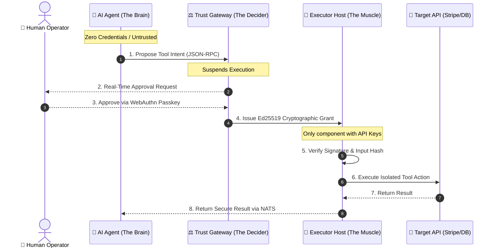

# Trust Gateway — Community Edition

[](https://www.rust-lang.org)
[](LICENSE)
[](https://nats.io)
[](https://modelcontextprotocol.io)
[](#quickstart-wire-claude-in-3-lines)

> **"Agents propose. Gateway decides. Executors verify."**

An open-source execution control plane that makes **unauthorized AI actions physically impossible** — not just policy-discouraged.

---

## The Problem

AI agents can now send emails, issue refunds, write to databases, and call SaaS APIs. But nothing prevents an agent from acting on a hallucination, a prompt injection, or an overly broad scope.

**Today, the only firewall between your production systems and AI chaos is prompt engineering — which is not a security boundary.**

## The Solution: Decouple Brain from Muscle

Trust Gateway puts a cryptographic chokepoint between intent and execution. The AI reasons. A separate, hardened layer decides. A third layer — the only one with credentials — executes.



**Even if a malicious prompt completely hijacks the AI Agent, the Brain physically lacks the cryptographic keys to execute unauthorized actions.** The prompt injection shatters harmlessly against the cryptographic firewall.

| Layer | Role | Security Boundary |
| :--- | :--- | :--- |
| 🧠 **The Brain** (AI Agent) | Formulates plans, proposes actions | **Untrusted** — holds zero credentials, zero API keys, zero direct network access |
| ⚖️ **The Decider** (Trust Gateway) | Evaluates policy, requests human approval, issues Ed25519 grants | **Cryptographically Sovereign** — deterministic rules, no LLM involved |
| 💪 **The Muscle** (Executor Host) | Re-verifies grant signature + input hash, then executes | **Isolated** — sole holder of API credentials, sandboxed execution |

---

## See It Live

Want to see this in action before installing anything?

- **[→ 6-minute walkthrough: How Claude integrates with the Trust Gateway](https://lianxi.io/blog/claude)** — Watch the complete lifecycle from proposal to passkey approval to execution.
- **[→ Explore the key concepts more in details](https://lianxi.io/blog)** — Dive into the architecture, understand why it matters, and if you are interested, spin up a live demo of entreprise version, or [get in touch](https://lianxi.io/contact) to discuss your use case.

---

## Quickstart: Wire Claude in 3 Lines

If you have a Trust Gateway running (locally or via the hosted demo), add this to your Claude Desktop config:

```json
// macOS: ~/Library/Application Support/Claude/claude_desktop_config.json
// Windows: %APPDATA%\Claude\claude_desktop_config.json
{
  "mcpServers": {
    "trust-gateway": {
      "command": "npx",
      "args": [
        "-y",
        "@anthropic-ai/mcp-server-sse-transport",
        "https://trust.lianxi.io/v1/mcp/sse"
      ]
    }
  }
}
```

Claude automatically discovers the MCP bridge on startup. Every tool call flows through the cryptographic approval chain before any execution occurs.

For **Claude.ai** web client: Settings → MCP Integrations → Add Server → enter `https://trust.lianxi.io/v1/mcp/sse` and complete the OAuth2 flow. Zero config files.

---

## What's in the Box

| Component | What it does |
| :--- | :--- |
| **`trust_gateway`** | Central policy engine and Ed25519 grant issuer |
| **`executor_host`** | Unified executor runtime (connector, native-tool, vp profiles) |
| **`agent_in_a_box`** | Sovereign host with WebAuthn passkey auth and WASM vault |
| **`ssi_agent`** | AI agent daemon with MCP tool orchestration |
| **`connector_mcp_server`** | OAuth2 helper for external SaaS handshakes (Google Calendar, etc.) |
| **`local_ssi_portal`** | Self-hosted Leptos web UI with real-time WebSocket feed |
| **`trust_core`** | Shared kernel: grant validation, auth, canonical JSON, schema snapshots |

**Transports:** MCP (Streamable HTTP + SSE), NATS/JetStream, Telegram bot, inbound webhooks, cron-scheduled skills.

**Identity:** WebAuthn (Level 5), did:web, did:twin, Verifiable Presentations, ledgerless contact handshake, DHT-based DID resolution.

---

## Self-Hosting

### Prerequisites
- **Rust** 1.75+
- **Wasm targets**: `rustup target add wasm32-wasip2 wasm32-unknown-unknown`
- **Wasm Component Tooling**: `cargo install cargo-component`
- **Trunk**: `cargo install --locked trunk`

```bash
git clone https://github.com/fcn06/trust_gateway.git
cd trust_gateway

# 1. Generate NATS nkeys for each service
cargo run --bin nkey_gen

# 2. Configure your deployment
cp .env.example .env
# Edit .env: set GRANT_SIGNING_KEY_PATH, NATS_URL, tenant config

# 3. Start the stack
./start_dev.sh
```

The portal runs at `http://localhost:8080`. The Trust Gateway listens on port `3060`. See the [Quick Start Guide](documentation/quick_start.md) for full details and verification steps.

> **Production guard:** The gateway panics at startup if `LIANXI_ENV` is not `development` and no Ed25519 key is configured. This is intentional.

### Experimental: Docker Compose (WIP)

We are developing a containerized setup to build and run the full community edition stack using Docker Compose. This is currently an **experimental work in progress** and is not yet finalized:

- Read the [Docker Compose Guide](lianxi-community/documentation/docker_experimental.md) to understand the current configuration.
- Follow the tutorial in [docker_experimental/how_to.md](lianxi-community/docker_experimental/how_to.md) to build and start the containers locally.


---

## Known Limitations

This is active pre-1.0 software. Read before deploying:

- **Native skill isolation** is OS-level process isolation, not a VM or container boundary. For untrusted skill authors, containerize the executor.
- **DIDComm envelope verification** relies on NATS nkey transport security rather than per-message Ed25519 signatures. A compromised NATS credential could forge protocol messages.
- **LLM-based data loss prevention** in the B2B agent is probabilistic. The deterministic `egress_validator` pipeline is the primary DLP control.
- **Grant signing key rotation** has no automated mechanism. Key compromise requires manual redeployment.
- **Stale tool registry** uses stale-while-revalidate caching. A revoked tool may remain callable until the cache TTL expires.

---

## Documentation

| Guide | What you'll learn |
| :--- | :--- |
| [Quick Start](documentation/quick_start.md) | Prerequisites, build, verify — connect your first agent in 5 minutes |
| [Security Model](documentation/security_model.md) | Governing invariants, grant lifecycle, policy engine, audit trail |
| [Architecture](documentation/architecture.md) | Multi-server topology, Wasm Component Model host, transport normalizer, "The Claw" |
| [Configuration](documentation/configuration.md) | Environment variables, `policy.toml` rule syntax, repository structure |
| [High-Level Flow](documentation/high_level_flow.md) | Step-by-step JSON-RPC proposal trace with mermaid diagram |
| [Interactive Walkthrough](documentation/interactive_walkthrough.md) | Hands-on: propose, approve, and execute a tool call |
| [Community vs. Professional](documentation/community_vs_enterprise.md) | Feature comparison grid |
| [Edition Boundaries](documentation/EDITION_BOUNDARIES.md) | Open-core architecture, compile-time feature gates, CI guardrails |
| [Telegram Integration](documentation/telegram_integration.md) | Webhook setup and OTP rate limits |
| [Docker Compose (Experimental)](lianxi-community/documentation/docker_experimental.md) | **(WIP)** Build and run the community edition stack using Docker Compose |

> **Looking for E2EE messaging, Wasm sandboxing, managed P2P routing, or Agent-as-a-Service?** These are in the [Professional Edition](documentation/community_vs_enterprise.md). The hosted demo at [portal.lianxi.io](https://portal.lianxi.io) runs the full Professional stack — [contact us](https://lianxi.io) to explore.

---

## Contributing

Issues, architecture questions, and pull requests welcome. Please read `CONTRIBUTING.md` before submitting changes to `trust_core` — schema snapshots in `snapshots/` are auto-validated and must be updated alongside any struct changes.

---

## License

- **Community Edition:** Apache 2.0 License.
- **Professional & Enterprise Edition:** Proprietary. Visit [lianxi.io](https://lianxi.io) for commercial licensing, managed routing nodes, and custom integrations.