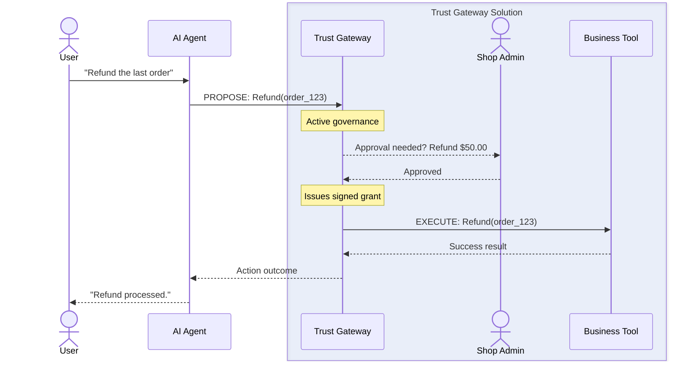

## The Active Control Plane: Intent vs. Execution

Most security layers are passive filters—they just watch traffic pass by. Trust Gateway is an **active execution plane**. It doesn't just watch; it **owns** the execution process.

Think of it like a **Notary Public** for AI. An agent can draft a contract (a tool call), but it has no power to sign it. Only the Notary (Trust Gateway) has the official stamp (cryptographic keys) to validate the intent and actually "file" it (execute the tool).

### High-Level Flow

By decoupling **intelligence** (the AI) from **capability** (the tools), we ensure that even if an agent "hallucinates" a dangerous command, it lacks the cryptographic authority to actually make it happen.
